# Projeto Supermercado Pirilampo

<p align="center">
  
</p>

<br />

<details>
<summary><strong>🧑‍💻 Sobre o projeto</strong></summary><br />

Filomena Esmeraldina Santos, mais conhecida como **Dona Filó**, é uma empreendedora da cidade de Quixeramobim. O seu supermercado, Pirilampo, precisa passar por um processo de transformação digital, e é aqui que você entra, como uma pessoa desenvolvedora de software.

Mas muita calma nessa hora! O desenvolvimento de sites é um processo complexo, e por isso, dividiremos as responsabilidades com várias pessoas.

Você será responsável por desenvolver **funções** que serão utilizadas para implementar as regras de negócio do site de Dona Filó. As funcionalidades entregues por você envolvem **manipulação e busca de produtos em estoque**.

Como sua responsabilidade é pela parte lógica, nenhuma tela será desenvolvida (HTML e CSS). Isso fica por conta do time de front-end. Posteriormente, quando o time de front finalizar toda parte gráfica, irão utilizar as funções desenvolvidas por você para dar vida ao site. Legal, né?

<br />
</details>

<details>
  <summary><strong>📝 Habilidades trabalhadas </strong></summary><br />

- Usar `variáveis` e `tipos de dados` para representar e armazenar informações;
- Usar `array` para manipular uma lista de elementos;
- Usar `objetos` para representar informações de forma estruturada;
- Usar `for` para percorrer uma lista de dados;
- Usar `if...else` para inserir condições lógicas nas regras de negócio;
- Aplicar `lógica de programação` para resolução de problemas.

</details>

<br />

## Requisitos do projeto

## `1 - Crie uma função que retorne a quantidade de produtos únicos em estoque`

O site do Supermercado Pirilampo possui uma área de Gestão de Estoque. Essa área precisa mostrar a quantidade de produtos únicos em estoque, um recurso muito útil para a Dona Filó conseguir gerenciar a variedade de mercadorias do seu estabelecimento. Você irá construir a função responsável por gerar essa informação, e para que você consiga visualizar onde sua função será utilizada, o time de front-end até desenvolveu um esboço!

<details>

<summary><strong>🏞️ Esboço</strong></summary>
<br />

|  |
| :------------------------------------------------------------------------: |
| Clique na imagem para ampliar                                              |

</details>

<details>

<summary><strong>💻 Desenvolva uma função que retorne o número de produtos únicos em estoque</strong></summary>

### Onde desenvolver seu código

- O arquivo que você implementará a solução se chama `1-unique-products-amount.js` e está dentro do diretório `src`;
- Sua implementação deve estar dentro da função `getUniqueProductsAmount`. Você **não deve** alterar o nome dela, mas caso haja necessidade, pode criar parâmetros para ela. Você também pode criar outras funções dentro do arquivo caso sinta a necessidade de organizar melhor o seu código.

### O que sua função deve fazer

- Sua função deve encontrar e retornar o tamanho o array `stockProducts` — que contém objetos de produtos do estoque.

<details>
<summary>📐 Exemplo</summary> <br />

| 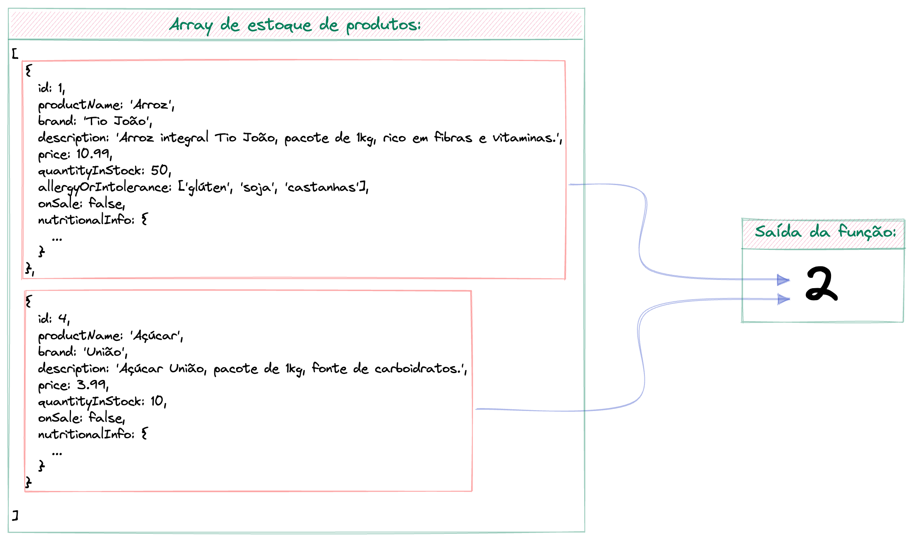 |
|:-----:|
| Clique na imagem para ampliar |

</details>

### Regras de negócio

- Sua função deve, obrigatoriamente, retornar um `number`;
- Produto único é um conceito utilizado para identificar exclusivamente um produto em estoque. Exemplo: o _Arroz Tio João_ tem 50 unidades em estoque, porém conta apenas como 1 produto;
- Considere que cada objeto do array `stockProducts` é um produto único.

### O que será testado

- O valor retornado pela função deve do tipo `number`;
- Ao utilizarmos o _data.json_ como fonte do estoque, a função deve retornar o número `29`;
- Em um cenário onde o estoque tenha 5 produtos únicos, a função deve retornar o número `5`;
- Em um cenário onde o estoque esteja vazio, a função deve retornar o número `0`.

</details>

<br/>

## `2 - Crie uma função que retorne os nomes dos produtos únicos em estoque`

Além da quantidade de produtos únicos, a área de Gestão de Estoque deve apresentar a lista com o nome dos produtos, funcionalidade muito útil para a Dona Filó visualizar todos os produtos que possui em estoque. Seria algo parecido com o esboço a seguir, segundo o time de front-end.

<details>

<summary><strong>🏞️ Esboço</strong></summary>
<br />

|  |
|:-----:|
| Clique na imagem para ampliar |

</details>

<details>

<summary><strong>💻 Desenvolva uma função que retorne um array com os nomes dos produtos únicos em estoque</strong></summary>

### Onde desenvolver seu código

- O arquivo que você implementará a solução se chama `2-unique-products-name.js` e está dentro do diretório `src`;
- Sua implementação deve estar dentro da função `getUniqueProductsName`. Você **não deve** alterar o nome dela, mas caso haja necessidade, pode criar parâmetros para ela. Você também pode criar outras funções dentro do arquivo caso sinta a necessidade de organizar melhor o seu código.

### O que sua função deve fazer

- Sua função deve percorrer o array `stockProducts` — que contém objetos de produto do estoque — em busca do **nome** de cada produto. Ao final, a função deverá retornar um nova lista que armazene o nome dos produtos.

<details>
<summary>📐 Exemplo</summary> <br />

| 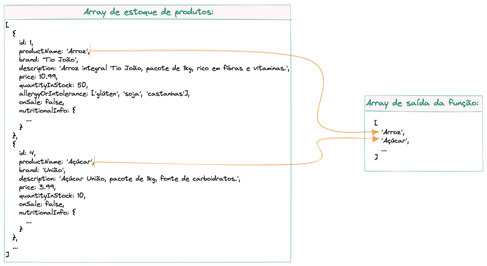 |
|:-----:|
| Clique na imagem para ampliar |

</details>

### Regras de negócio

- Sua função deve, obrigatoriamente, retornar um `array` de `string`;
- O `array` retornado pela função deve ter o nome de **todos** os produtos do `array` de objetos em estoque.

<details>
<summary>🔡 Exemplo do formato esperado para o array de retorno</summary> <br />

```js
[
  'Arroz',
  'Feijão',
  'Macarrão',
  'Açúcar',
  ...
]
```

</details>

### O que será testado

- O valor retornado pela função deve ser um `array`;
- Todos os elementos do array retornado pela função devem ser do tipo `string`;
- Ao utilizarmos o _data.json_ como fonte do estoque, o índice `0` do array retornado pela função deve conter o valor `Arroz`;
- Ao utilizarmos o _data.json_ como fonte do estoque, o índice `24` do array retornado pela função deve conter o valor `Rúcula`;
- Em um cenário onde o estoque tenha 29 produtos, a função deve retornar um array com `29` elementos;
- Em um cenário onde o estoque esteja vazio, a função deve retornar um array com `0` elementos.

</details>

<br/>

## `3 - Crie uma função que retorne os nomes dos produtos indisponíveis do estoque`

Para conseguir se planejar melhor com a compra de produtos que estão em falta, nossa idolatrada Dona Filó precisa ter conhecimento de quais produtos são esses. Para isso, dentro da seção de Gerenciamento de Estoque, vamos ter uma subseção que mostra os produtos indisponíveis.

<details>

<summary><strong>🏞️ Esboço</strong></summary>
<br />

| 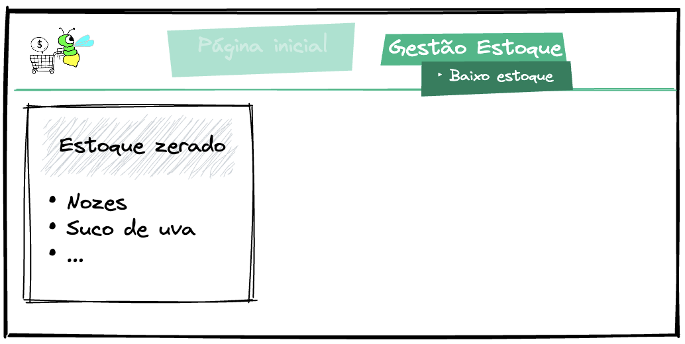 |
|:-----:|
| Clique na imagem para ampliar |

</details>

<details>

<summary><strong>💻 Desenvolva uma função que retorne um array com os nomes dos produtos indisponíveis</strong></summary>

### Onde desenvolver seu código

- O arquivo que você implementará a solução se chama `3-out-of-stock-products.js` e está dentro do diretório `src`;
- Sua implementação deve estar dentro da função `getOutOfStockProducts`. Você **não deve** alterar o nome dela, mas caso haja necessidade, pode criar parâmetros para ela. Você também pode criar outras funções dentro do arquivo caso sinta a necessidade de organizar melhor o seu código.

### O que sua função deve fazer

- Sua função deve percorrer o array `stockProducts` — que contém objetos de produto do estoque — em busca do **nome** de cada produto que esteja indisponível no estoque. Ao final, a função deverá retornar uma nova lista que armazene o nome dos produtos.

<details>
<summary>📐 Exemplo</summary> <br />

|  |
|:-----:|
| Clique na imagem para ampliar |

</details>

### Regras de negócio

- Sua função deve, obrigatoriamente, retornar um `array` de `string`;
- Um produto será considerado fora de estoque quando a propriedade `quantityInStock` dele for **igual a `0`**.

<details>
<summary>🔡 Exemplo do formato esperado para o array de retorno</summary> <br />

```js
[
  'Lentilha',
  'Suco de uva',
  'Nozes',
  ...
]
```

</details>

### O que será testado

- O valor retornado pela função deve ser um `array`;
- Todos os elementos do array retornado pela função devem ser do tipo `string`;
- Ao utilizarmos o _data.json_ como fonte do estoque, a função retorna um array com `4` elementos;
- Em um cenário onde o estoque tenha 20 produtos indisponíveis, a função retorna um array com `20` elementos.

</details>

<br/>

## `4 - Crie uma função que retorne os produtos com baixo estoque em um formato específico`

Boa gestora que é, Dona Filó busca manter seu supermercado sempre bem abastecido de mercadorias. Ela precisa ter visibilidade não só dos produtos que estão em falta, mas também dos produtos que estão prestes a se esgotar. Por conta disso, precisamos desenvolver uma área que apresente qual produto está com estoque baixo e quantos deste produto estão no estoque.

<details>

<summary><strong>🏞️ Esboço</strong></summary>
<br />

| 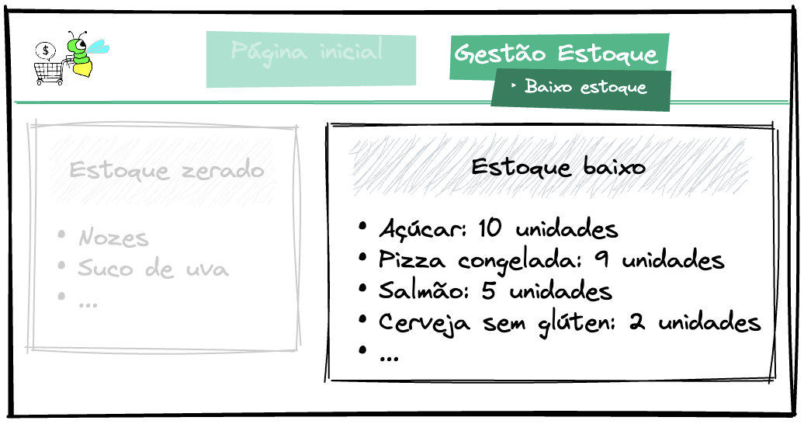 |
|:-----:|
| Clique na imagem para ampliar |

</details>

<details>

<summary><strong>💻 Desenvolva uma função que retorne um array com os produtos com baixo estoque, em um formato específico</strong></summary>

### Onde desenvolver seu código

- O arquivo que você implementará a solução se chama `4-low-stock-products.js` e está dentro do diretório `src`;
- Sua implementação deve estar dentro da função `getLowStockProducts`. Você **não deve** alterar o nome dela, mas caso haja necessidade, pode criar parâmetros para ela. Você também pode criar outras funções dentro do arquivo caso sinta a necessidade de organizar melhor o seu código.

### O que sua função deve fazer

- Sua função deve percorrer o array `stockProducts` — que contém objetos de produto do estoque — em busca do **nome** e da **quantidade em estoque** de cada produto que esteja com baixo estoque. Ao final, a função deverá retornar uma nova lista que armazene uma mensagem personalizada informando o **nome** e a **quantidade do produto**.

<details>
<summary>📐 Exemplo</summary> <br />

|  |
|:-----:|
| Clique na imagem para ampliar |

</details>

### Regras de negócio

- Sua função deve, obrigatoriamente, retornar um `array` de `string`;
- Um produto será considerado com baixo estoque quando a propriedade `quantityInStock` dele for **maior que `0`** e **menor ou igual a `10`**;
- O formato dos elementos do array deve ser: `{nome do produto}: {quantidade em estoque} unidades`;
- Você não deve se preocupar com a flexão de números dos substantivos nesse momento. Se o produto tiver 1 unidade em estoque, a mensagem deverá ser apresentar a palavra _unidades_ no plural. Exemplo: _"Pipoca: 1 unidades"_.

<details>
<summary>🔡 Exemplo do formato esperado para o array de retorno</summary> <br />

```js
[
  'Nutella: 10 unidades',
  'Salmão: 5 unidades',
  'Pipoca: 1 unidades',
  ...
]
```

</details>

### O que será testado

- O valor retornado pela função deve ser um `array`;
- Todos os elementos do array retornado pela função devem ser do tipo `string`;
- Os elementos do array retornados devem estar no formato `{nome do produto}: {quantidade em estoque} unidades`;
- Ao utilizarmos o _data.json_ como fonte do estoque, a função retorna um array com `7` elementos;
- Em um cenário onde 20 produtos estão com baixo estoque, a função retorna um array com `20` elementos.

</details>

<br/>

## `5 - Crie uma função que retorne o total de produtos em estoque`

A quantidade única de produtos não consegue representar o tamanho do estoque. Um grande exemplo disso é que podemos ter 1 produto (_Farinha_) cadastrado no sistema, mas com centenas de pacotes no estoque. É importante para a mestra do empreendedorismo, Dona Filó, ter noção do tamanho do seu estoque, pois dependendo do movimento do seu supermercado, expandir o galpão que armazena todos os produtos pode ser uma opção. O time de front-end, já prevenindo tal funcionalidade, deixou um esboço para entendimento.

<details>

<summary><strong>🏞️ Esboço</strong></summary>
<br />

|  |
|:-----:|
| Clique na imagem para ampliar |

</details>

<details>

<summary><strong>💻 Desenvolva uma função que retorne o número de produtos em estoque</strong></summary>

### Onde desenvolver seu código

- O arquivo que você implementará a solução se chama `5-products-amount.js` e está dentro do diretório `src`;
- Sua implementação deve estar dentro da função `getProductsAmount`. Você **não deve** alterar o nome dela, mas caso haja necessidade, pode criar parâmetros para ela. Você também pode criar outras funções dentro do arquivo caso sinta a necessidade de organizar melhor o seu código.

### O que sua função deve fazer

- Sua função deve percorrer o array `stockProducts` — que contém objetos de produto do estoque — em busca da **quantidade em estoque** de cada produto. Ao final, a função deverá retornar o somatório da quantidade de todos os produtos em estoque.

<details>
<summary>📐 Exemplo</summary> <br />

|  |
|:-----:|
| Clique na imagem para ampliar |

</details>

### Regras de negócio

- Sua função deve, obrigatoriamente, retornar um `number`;
- Utilize a propriedade `quantityInStock`, do objeto de produto do estoque, para acumular os totais de todos os produtos do estoque.

### O que será testado

- O valor retornado pela função deve ser do tipo `number`;
- Ao utilizarmos o _data.json_ como fonte do estoque, a função deve retornar o número `633`;
- Em um cenário onde o estoque tenha 4857 produtos, a função deve retornar o número `4857`.

</details>

<br/>

## `6 - Crie uma função que busque um produto pelo nome`

Agora que terminamos de criar as funções que entregam a lógica da área de Gestão de Estoque, podemos partir para a criação das funções que vão ajudar a construir a Página Inicial do Supermercado Pirilampo. Iniciaremos a construção lógica da Página Inicial fornecendo a funcionalidade de buscar um produto pelo seu nome. A ideia é que essa função seja utilizada para desenvolver uma página parecida com o exemplo do esboço a seguir.

<details>

<summary><strong>🏞️ Esboço</strong></summary>
<br />

|  |
|:-----:|
| Clique na imagem para ampliar |

</details>

<details>

<summary><strong>💻 Desenvolva uma função que permita buscar um produto pelo seu nome</strong></summary>

### Onde desenvolver seu código

- O arquivo que você implementará a solução se chama `6-search-product-by-name.js` e está dentro do diretório `src`;
- Sua implementação deve estar dentro da função `searchProductByName`. Você **não deve** alterar o nome dela, mas caso haja necessidade, pode criar parâmetros para ela. Você também pode criar outras funções dentro do arquivo caso sinta a necessidade de organizar melhor o seu código.

### O que sua função deve fazer

- Sua função deve percorrer o array `stockProducts` — que contém objetos de produto do estoque — em busca do **nome** de um produto específico. Caso o produto seja encontrado, a função irá retornar um novo objeto com as propriedades de **descrição** e **valor formatado do produto**. Caso contrário, sua função irá retornar **um valor nulo**.

<details>
<summary>📐 Exemplo: cenário onde um produto é encontrado</summary> <br />

|  |
|:-----:|
| Clique na imagem para ampliar |

</details>

<details>
<summary>📐 Exemplo: cenário onde um produto não é encontrado</summary> <br />

| 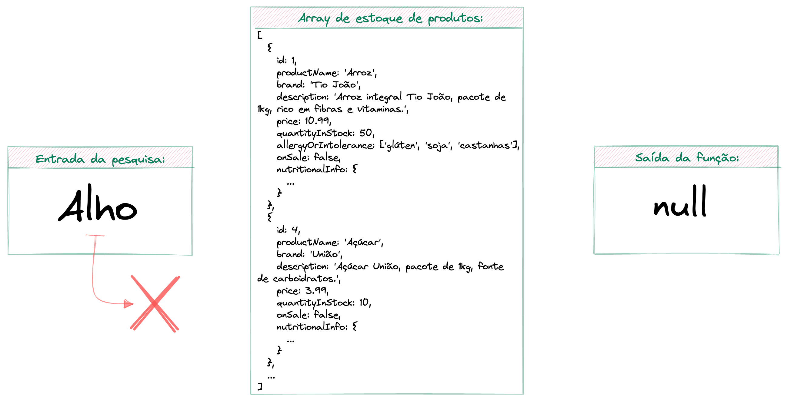 |
|:-----:|
| Clique na imagem para ampliar |

</details>

### Regras de negócio

- Sua função deverá receber o nome do produto por parâmetro;
- Considere que o nome do produto é único. Portanto essa função **não retorna** um `array` de produtos e sim um `object` com as informações dele;
- Se o produto for encontrado, sua função irá retornar um novo objeto com as seguintes chaves:
    - **`description`:** descrição do produto, sem nenhuma modificação

    - **`formattedPrice`:** prefixo da moeda Real (`R$`) acrescido do preço do produto (`1.99`, por exemplo), com 1 espaço entre os dados. Além disso, o separador de casas decimais será o ponto (`.`), uma vez que a informação do _data.json_ já se encontra nesse formato. Exemplo: `R$ 10.99`

- Se o produto não for encontrado, sua função irá retornar `null`;
- A função deve retornar `null` caso seja chamada **sem parâmetro**.

<details>
<summary>🔡 Exemplo do formato esperado caso a função encontre um produto</summary> <br />

```js
{
  description: 'Creme de avelã com cacau Nutella, pote de 350g, ideal para passar no pão ou comer com frutas.',
  formattedPrice: 'R$ 19.99'
}
```

</details>

### O que será testado

- Ao buscar por um produto existente, o valor retornado pela função **não** deve ser `null`;
- Ao buscar por um produto existente, a função deve retornar um objeto com as 2 chaves: `description` e `formattedPrice`;
- Ao buscar por um produto existente, a função deve retornar um objeto cuja chave `description` seja a mesma do objeto original e a chave `formattedPrice` esteja dentro do formato `R$ XX.YY` ou `R$ X.YY`;
- Ao buscar por um produto inexistente, o valor retornado pela função deve ser `null`;
- Ao chamar a função sem passar parâmetro, o valor retornado deve ser `null`.

</details>

<br/>

## `7 - Crie uma função que busque por produtos de uma marca específica`

Outra funcionalidade crucial para a Página Inicial é a busca por produtos através da marca. Segundo a inoxidável Dona Filó, existem algumas marcas que são as "queridinhas" da sua clientela. Sua lógica será desenvolvida em uma função separada, mas o time de front-end irá aproveitar a mesma área de pesquisa utilizada anteriormente. Para ter ideia de como será o layout dessa funcionalidade, o time também disponibilizou um esboço.

<details>

<summary><strong>🏞️ Esboço</strong></summary>
<br />

|  |
|:-----:|
| Clique na imagem para ampliar |

</details>

<details>

<summary><strong>💻 Desenvolva uma função que permita buscar produtos pela marca</strong></summary>

### Onde desenvolver seu código

- O arquivo que você implementará a solução se chama `7-search-products-by-brand.js` e está dentro do diretório `src`;
- Sua implementação deve estar dentro da função `searchProductsByBrand`. Você **não deve** alterar o nome dela, mas caso haja necessidade, pode criar parâmetros para ela. Você também pode criar outras funções dentro do arquivo caso sinta a necessidade de organizar melhor o seu código.

### O que sua função deve fazer

- Sua função deve percorrer o array `stockProducts` — que contém objetos de produto do estoque — em busca de produtos de uma **marca** específica. Caso produtos sejam encontrados, a função deverá retornar uma nova lista de objetos com as propriedades de **descrição** e **valor formatado do produto**. Caso contrário, sua função irá retornar **uma lista vazia**.

<details>
<summary>📐 Exemplo: cenário onde produtos são encontrados</summary> <br />

| 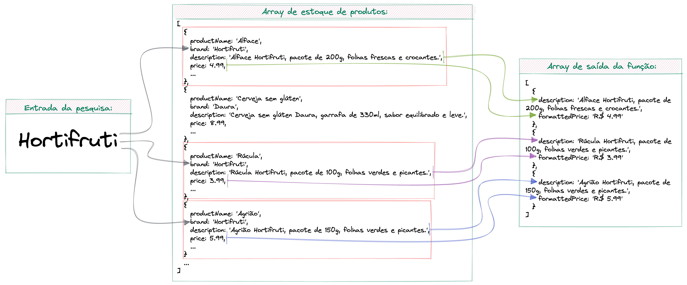 |
|:-----:|
| Clique na imagem para ampliar |

</details>

<details>
<summary>📐 Exemplo: cenário onde produtos não são encontrados</summary> <br />

|  |
|:-----:|
| Clique na imagem para ampliar |

</details>

### Regras de negócio

- Sua função deverá receber a marca por parâmetro;
- Se produtos forem encontrados, sua função irá retornar um novo `array` de objetos. Cada objeto deve ter as seguintes chaves:
    - **`description`:** descrição do produto, sem nenhuma modificação

    - **`formattedPrice`:** prefixo da moeda Real (`R$`) acrescido do preço do produto (`1.99`, por exemplo), com 1 espaço entre os dados. Além disso, o separador de casas decimais será o ponto (`.`), uma vez que a informação do _data.json_ já se encontra nesse formato. Exemplo: `R$ 10.99`

- Se nenhum produto for encontrado, sua função irá retornar um `array` vazio;
- A função deve retornar um `array` vazio caso seja chamada **sem parâmetro**.

<details>
<summary>🔡 Exemplo do formato esperado caso a função encontre produtos de uma marca</summary> <br />

```js
[
  {
    description: 'Batata Doce Hortifruti, pacote de 1kg, batatas doces frescas e saborosas.',
    formattedPrice: 'R$ 6.99'
  },
  {
    description: "Cenoura Hortifruti, pacote de 500g, cenouras frescas e crocantes.",
    formattedPrice: 'R$ 3.99'
  }
  ...
]
```

</details>

### O que será testado

- Ao buscar por uma marca existente, o valor retornado pela função deve ser um `array` de elementos do tipo `object`;
- Ao buscar por uma marca inexistente, o valor retornado pela função deve ser um array `vazio`;
- Ao chamar a função sem passar parâmetro, o valor retornado pela função deve ser um array `vazio`;
- Ao buscar pela marca "Hortifruti", utilizando o _data.json_ como fonte do estoque, a função deve retornar um array com `6` elementos;
- Ao buscar produtos pela marca, o array retornado deve ter objetos cuja chave `description` seja a mesma do objeto original e a chave `formattedPrice` esteja dentro do formato `R$ XX.YY` ou `R$ X.YY`.

</details>

<br/>

## `8 - Crie uma função que busque por produtos na promoção`

Toda clientela gosta de uma boa promoção, não é mesmo? Pensando nisso, uma área com os produtos em oferta é altamente estratégico para nossa apreciada Dona Filó. Seu desafio aqui será desenvolver a função que recuperará os produtos em promoção, para serem adicionados em uma nova seção.

<details>

<summary><strong>🏞️ Esboço</strong></summary>
<br />

| 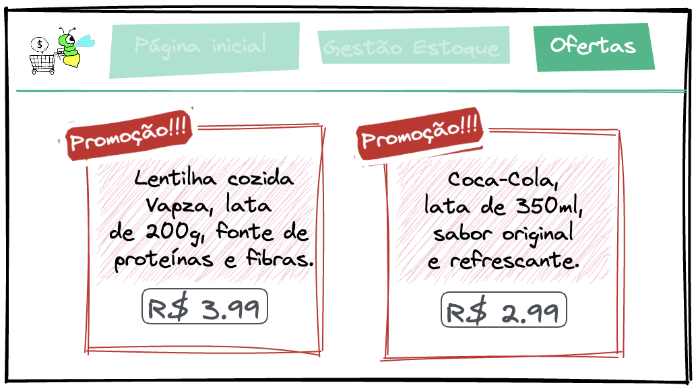 |
|:-----:|
| Clique na imagem para ampliar |

</details>

<details>

<summary><strong>💻 Desenvolva uma função que retorne os produtos em promoção</strong></summary>

### Onde desenvolver seu código

- O arquivo que você implementará a solução se chama `8-products-on-sale.js` e está dentro do diretório `src`;
- Sua implementação deve estar dentro da função `getProductsOnSale`. Você **não deve** alterar o nome dela, mas caso haja necessidade, pode criar parâmetros para ela. Você também pode criar outras funções dentro do arquivo caso sinta a necessidade de organizar melhor o seu código.

### O que sua função deve fazer

- Sua função deve percorrer o array `stockProducts` — que contém objetos de produto do estoque — em busca de produtos **em promoção**. Caso produtos sejam encontrados, a função irá retornar uma nova lista de objetos com as propriedades de **descrição**, o **valor formatado do produto** e a **informação booleana de oferta**.

<details>
<summary>📐 Exemplo</summary> <br />

|  |
|:-----:|
| Clique na imagem para ampliar |

</details>

### Regras de negócio

- Um produto é considerado em promoção quando a chave `onSale` tiver o valor `true`;
- Se produtos forem encontrados, sua função irá retornar um novo `array` de objetos. Cada objeto deve ter as seguintes chaves:
    - **`description`:** descrição do produto, sem nenhuma modificação

    - **`formattedPrice`:** prefixo da moeda Real (`R$`) acrescido do preço do produto (`1.99`, por exemplo), com 1 espaço entre os dados. Além disso, o separador de casas decimais será o ponto (`.`), uma vez que a informação do _data.json_ já se encontra nesse formato. Exemplo: `R$ 10.99`

    - **`onSale`:** informação booleana identificando que o produto está em promoção

<details>
<summary>🔡 Exemplo do formato esperado caso a função encontre produtos em promoção</summary> <br />

```js
[
  {
    description: "Biscoito recheado Nestlé, pacote de 130g, sabor chocolate.",
    formattedPrice: 'R$ 1.99',
    onSale: true
  },
  {
    description: "Filé de salmão Seara, embalagem de 500g, fonte de proteínas e ômega-3.",
    formattedPrice: 'R$ 39.99',
    onSale: true
  },
  ...
]
```

</details>

### O que será testado

- Ao buscar por produtos em promoção, o valor retornado pela função deve ser um `array` de elementos do tipo `object`;
- Os objetos do array devem ter 3 chaves: `description`, `formattedPrice` e `onSale`;
- O array retornado deve ter objetos cuja chave `description` seja a mesma do objeto original, a chave `formattedPrice` esteja dentro do formato `R$ XX.YY` ou `R$ X.YY` e a chave `onSale` seja `true`.

</details>

<br/>

## `9 - Crie uma função que retorne todos os produtos com informações sobre alergia ou intolerância`

Com o aumento da demanda de produtos para pessoas com algum tipo de alergia ou intolerância alimentar, é importante que o site do supermercado mostre essas informações para ter mais assertividade nas vendas. O time de front-end ainda está conversando com a condecorada Dona Filó para entender onde colocar as informações e até nos entregou um esboço. Porém, já temos a demanda de criar uma função que retorne todos os produtos do estoque que podem gerar alergia ou intolerância em um formato específico.

<details>

<summary><strong>🏞️ Esboço</strong></summary>
<br />

| 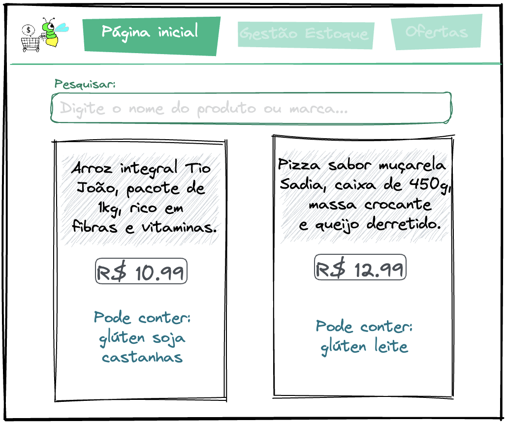 |
|:----------------------------------------------------------------------------------------------:|
|                                  Clique na imagem para ampliar                                 |

</details>

<details>

<summary><strong>💻 Desenvolva uma função que retorne os produtos em estoque com informações de alergia ou intolerância alimentar</strong></summary>

### Onde desenvolver seu código

- O arquivo que você implementará a solução se chama `9-products-with-allergy-or-intolerance-info.js` e está dentro do diretório `src`;
- Sua implementação deve estar dentro da função `getProductsWithAllergyOrIntoleranceInfo`. Você **não deve** alterar o nome dela, mas caso haja necessidade, pode criar parâmetros para ela. Você também pode criar outras funções dentro do arquivo caso sinta a necessidade de organizar melhor o seu código.

### O que sua função deve fazer

- Sua função deve percorrer o array `stockProducts` — que contém objetos de produto do estoque — em busca de produtos **com informações de alergia e intolerância alimentar**. Caso produtos sejam encontrados, a função irá retornar uma nova lista de objetos com as propriedades de **descrição**, o **valor formatado do produto** e a **informação formatada de alergia e intolerância**.

<details>
<summary>📐 Exemplo</summary> <br />

| 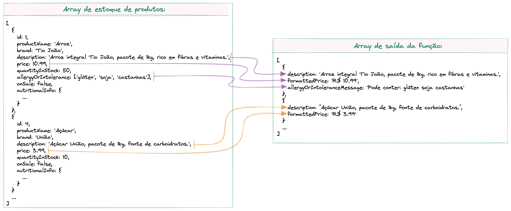 |
|:-----:|
| Clique na imagem para ampliar |

</details>

### Regras de negócio

- Sua função deve, obrigatoriamente, retornar um `array` de objetos com as seguintes chaves:
    - **`description`:** descrição do produto, sem nenhuma modificação

    - **`formattedPrice`:** prefixo da moeda Real (`R$`) acrescido do preço do produto (`1.99`, por exemplo), com 1 espaço entre os dados. Além disso, o separador de casas decimais será o ponto (`.`), uma vez que a informação do _data.json_ já se encontra nesse formato. Exemplo: `R$ 10.99`

    - **`allergyOrIntoleranceMessage`:** deve ser do tipo `string` e só será adicionada ao novo objeto quando houver informações de alergia ou intolerância no objeto do produto. Deve seguir o seguinte formato: `Pode conter: {item 1} {item 2} {item N}`. A quantidade de itens varia de acordo com o tamanho do array `allergyOrIntolerance` do produto em estoque

<details>
<summary>🔡 Exemplo do formato esperado para o array de retorno</summary> <br />

```js
[
  {
    description: 'Arroz integral Tio João, pacote de 1kg, rico em fibras e vitaminas.',
    formattedPrice: "R$ 10.99",
    allergyOrIntoleranceMessage: 'Pode conter: glúten soja castanhas'
  },
  {
    description: 'Lentilha cozida Vapza, lata de 200g, fonte de proteínas e fibras.',
    formattedPrice: "R$ 3.99"
  },
  ...
]
```

</details>

### O que será testado

- Ao buscar por produtos com informação de alergia ou intolerância, o valor retornado pela função deve ser um `array` cujo os elementos sejam do tipo `object`;
- Os objetos do array devem possuir, obrigatoriamente, as chaves `description` e `formattedPrice`;
- O valor da chave `description` deve ser o mesmo do objeto original, a chave `formattedPrice` deve estar no formato `R$ XX.YY` ou `R$ X.YY` e, quando o produto possuir informações de alergia ou intolerância, o valor da chave `allergyOrIntoleranceMessage` deve seguir o formato `Pode conter: {item 1} {item 2} {item N}`.

</details>

<br/>

## `10 - Crie uma função que retorne todos os produtos que possuam alguma vitamina em seu valor nutricional`

Pensando na saúde das pessoas, a incomensurável Dona Filó teve uma ideia: criar uma seção na Página Inicial para listar alimentos ricos em vitaminas. Você será responsável por desenvolver a função que retorna esses produtos, enquanto o time de front finaliza o layout.

<details>

<summary><strong>🏞️ Esboço</strong></summary>
<br />

| 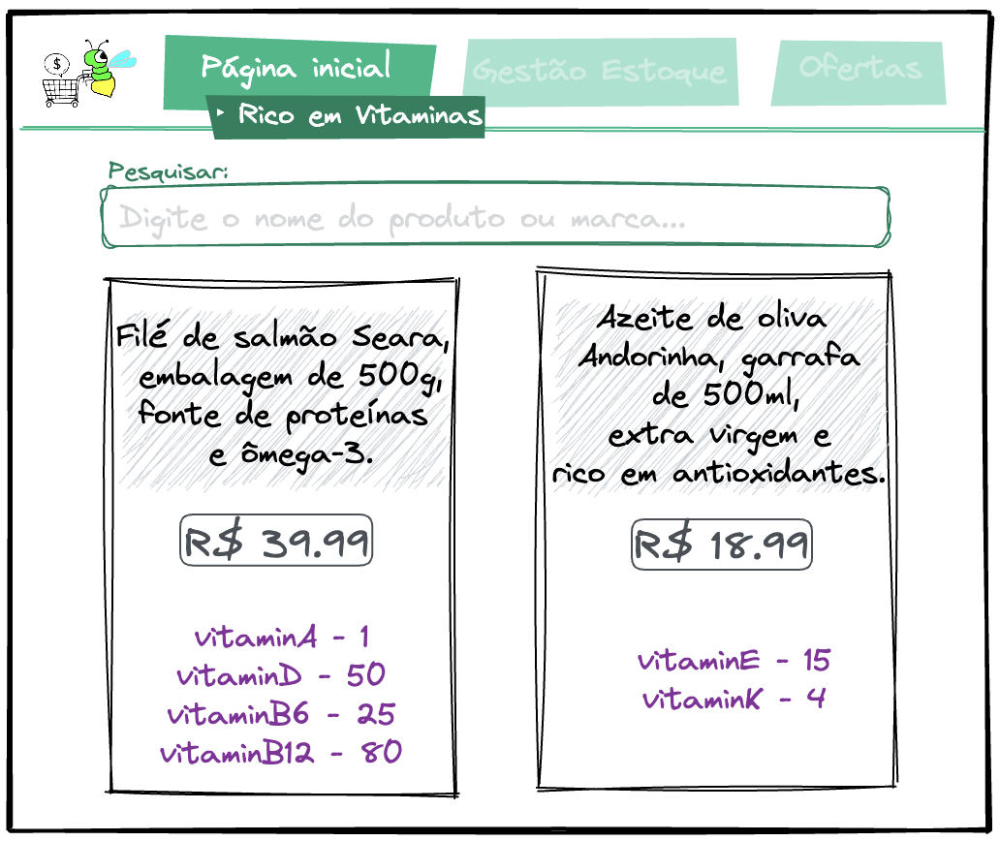 |
|:-----:|
| Clique na imagem para ampliar |

</details>

<details>

<summary><strong>💻 Desenvolva uma função que retorne produtos ricos em vitaminas</strong></summary>

### Onde desenvolver seu código

- O arquivo que você implementará a solução se chama `10-products-rich-in-vitamin.js` e está dentro do diretório `src`;
- Sua implementação deve estar dentro da função `getProductsRichInVitamin`. Você **não deve** alterar o nome dela, mas caso haja necessidade, pode criar parâmetros para ela. Você também pode criar outras funções dentro do arquivo caso sinta a necessidade de organizar melhor o seu código.

### O que sua função deve fazer

- Sua função deve percorrer o array `stockProducts` — que contém objetos de produto do estoque — em busca de produtos **com informações de vitaminas**. Caso produtos sejam encontrados, a função irá retornar uma nova lista de objetos com as propriedades de **descrição**, o **valor formatado do produto** e a **lista de vitaminas disponíveis no produto**.

<details>
<summary>📐 Exemplo</summary> <br />

| 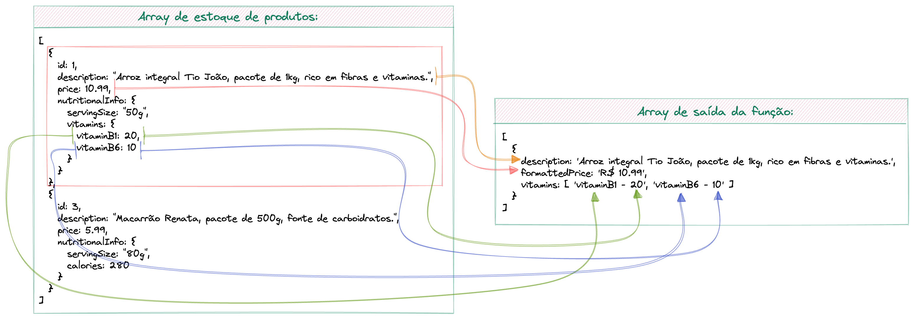 |
|:-----:|
| Clique na imagem para ampliar |

</details>

### Regras de negócio

- Sua função deve, obrigatoriamente, retornar um `array` de objetos com as seguintes chaves:
    - **`description`:** descrição do produto, sem nenhuma modificação

    - **`formattedPrice`:** prefixo da moeda Real (`R$`) acrescido do preço do produto (`1.99`, por exemplo), com 1 espaço entre os dados. Além disso, o separador de casas decimais será o ponto (`.`), uma vez que a informação do _data.json_ já se encontra nesse formato. Exemplo: `R$ 10.99`

    - **`vitaminsInformation`:** deve ser um `array` de `string`. O texto dos elementos desse array deve seguir o formato `{nome da vitamina} - {quantidade de vitamina presente}`. A informação do nome da vitamina é encontrada nas **chaves do objeto `nutritionalInfo.vitamins`** do produto em estoque, já a informação de quantidade de vitamina presente é encontrada nos valores do mesmo objeto

<details>
<summary>🔡 Exemplo do formato esperado para o array de retorno</summary> <br />

```js
[
  {
    description: 'Nozes sem casca Fazenda São Francisco, pacote de 200g, fonte de gorduras boas e minerais.',
    formattedPrice: 'R$ 19.99',
    vitaminsInformation: [ 'vitaminB6 - 5' ]
  },
  {
    description: 'Filé de salmão Seara, embalagem de 500g, fonte de proteínas e ômega-3.',
    formattedPrice: 'R$ 39.99',
    vitaminsInformation: ['vitaminA - 1', 'vitaminD - 50', 'vitaminB6 - 25', 'vitaminB12 - 80']
  },
  {
    description: 'Carne bovina moída Swift, pacote de 500g, ideal para preparar diversas receitas.',
    formattedPrice: 'R$ 14.99',
    vitaminsInformation: [ 'vitaminB6 - 15', 'vitaminB12 - 50' ]
  },
  ...
]
```

</details>

### O que será testado

- A função `getProductsRichInVitamin` não deve retornar um array vazio;
- O valor retornado pela função deve ser um `array` cujo os elementos sejam do tipo `object`;
- Os objetos do array devem ter 3 chaves: `description`, `formattedPrice` e `vitaminsInformation`;
- O valor da chave `description` deve ser o mesmo do objeto origina, a chave `formattedPrice` dos objetos deve estar dentro do formato `R$ XX.YY` ou `R$ X.YY` e a chave `vitaminsInformation` dos objetos deve estar dentro do formato `{nome da vitamina} - {quantidade de vitamina presente}`;
- A chave `vitaminsInformation` dos objetos deve ser um `array`;

</details>

<br />
